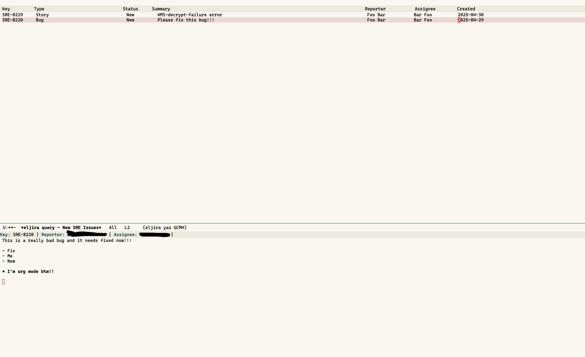

# Overview

**eljira** is an Emacs package that provides an interface for interacting with Jira. It allows users
to create, view, and edit issues.

My main motiviation for creating this package was custom field support.  I have tried many other
Emacs Jira clients, and [jira-cli](https://github.com/ankitpokhrel/jira-cli), but none of them had
the support for custom fields I needed.

## WIP

This project is not well documented, there are _many_ features missing, and probably plenty of bugs.
I reached a point where it works for me so motivation become sparse. I figured I could either share
it as is, or not share it at all.

A few words of warning:

- I might work on refining it when the urge arises, but I make no promises.
- If questions show up in the issues, I will do my best to help hack your way through it, as I have in my config.
- This is my first lisp project. I was liberal in experimenting with different lisp concepts.

# Usage

Usage of eljira is primarily done through **queries** and **contexts**

## Quick Start

1. Setup the required variables:

```emacs-lisp
(defcustom eljira-token "your_jira_token"
  "Jira token for API authentication.")

(defcustom eljira-username "your_jira_username"
  "Jira username for API authentication.")

(defcustom eljira-url "https://your-domain.atlassian.net"
  "The Jira base URL.")
```

2. Run:

```emacs-lisp
M-x eljira
```

 

The top window is the `query` window, and the bottom window is the `context` window.

3. Press `h` for key binding help.

4. See [Configuration](#Configuration) for more details

# Configuration

## Queries

The custom variable `eljira-queries` holds all the power in eljira.

In this variable, the user defines the JQL to fetch issues, and the fields to fetch and display in
the user-interface. Custom fields are supported.  

When the user runs `M-x eljira`, they will be prompted for a query. The issues will then be presented in the 'query window'.

See the docstring for `eljira-queries` to understand how to configure this variable.

### Example

```emacs-lisp
(setq eljira-queries '(
  (:name "My Issues"
   :jql "project = \"SRE\" AND assignee = currentUser() AND resolution = Unresolved ORDER BY created DESC"
   :fields (
    (:name "Key" :formatter (lambda (value)
                               (propertize value 'face 'bold)))
    (:name "Type" :field "issuetype")
    (:name "Status" :field "status")
    (:name "Summary" :field "summary")
    (:name "Reporter" :field "reporter")
    (:name "Points" :field "customfield_10000" :min-width 7
           :formatter (lambda (value)
                        (number-to-string (if value (round value) 0))))
    (:name "Comments" :field "comment" :hide t)
    (:name "Parent" :field "parent" :getter (lambda (issue table)
                                               (let-alist (eljira-issue-fields issue)
                                                 .parent.key)))
    (:name "Description" :field "description" :hide t))) ;; Description will not be shown in the user-interface
  
  (:name "My Issues - In Progress"
   :jql "project = \"SRE\" AND assignee = currentUser() AND status = \"In Progress\" ORDER BY type DESC"
   :fields (
    (:name "Key" :formatter (lambda (value)
                               (propertize value 'face 'bold)))
    (:name "Type" :field "issuetype")
    (:name "Status" :field "status")
    (:name "Summary" :field "summary")
    (:name "Reporter" :field "reporter")
    (:name "Points" :field "customfield_10000" :min-width 7
           :formatter (lambda (value)
                        (number-to-string (if value (round value) 0))))
    (:name "Comments" :field "comment" :hide t)
    (:name "Parent" :field "parent" :getter (lambda (issue table)
                                               (let-alist (eljira-issue-fields issue)
                                                 .parent.key)))
    (:name "Description" :field "description" :hide t)))
  
  (:name "Issues Completed Past Week"
   :jql "assignee = currentUser() AND status = Done AND updated >= -1w"
   :fields (
    (:name "Key" :formatter (lambda (value)
                               (propertize value 'face 'bold)))
    (:name "Type" :field "issuetype")
    (:name "Status" :field "status")
    (:name "Summary" :field "summary")
    (:name "Reporter" :field "reporter")
    (:name "Assignee" :field "assignee")
    (:name "Points" :field "customfield_10000" :min-width 7
           :formatter (lambda (value)
                        (number-to-string (if value (round value) 0))))
    (:name "Comments" :field "comment" :hide t)
    (:name "Description" :field "description" :hide t))))

```

## Custom Fields

If you want to edit customfields when creating and editing issues, you will want to modify the following variables:

- eljira-customfields
- eljira-static-customfields

See the docstrings for more info.

Here is an example:

```emacs-lisp
(setq eljira-customfields '((:name "Points" :key "p" :field "customfield_10000" :type integer)
							(:name "Need by date" :key "d" :field "customfield_10001" :type date)))

(setq eljira-static-customfields `(("customfield_10002" . (("value" . "FooBar"))))))
```

## Contexts

In the user-interface, the bottomw window is the 'context window'. This window presents additional
context about the issue that the user's point is currently on in the 'query window'.

For information on creating new contexts, see: `eljira-contexts` and `make-eljira-context`.

# Acknowledgments

Huge shout out to nyyMannni, the creater of ejira: https://github.com/nyyManni/ejira This package
relies heavily on his `jiralib2` and `jira-parser` (jira to org parsing). I would not have been able
to do half the things I wanted without these libraries.
